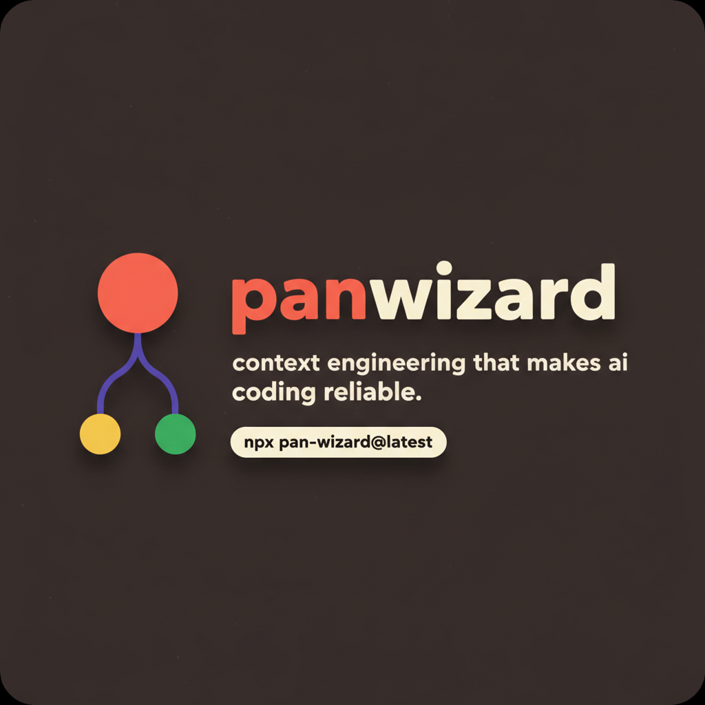

<div align="center">

<!-- Replace with the generated banner (Nano Banana prompt #1) or a 2x screenshot
     of the README hero card in PanWizard Brand.dc.html -->


# PanWizard

**Project Automation Navigator** — a lightweight workflow-automation and
context-engineering system for Claude Code, OpenCode, Gemini CLI, Codex and
Copilot CLI.

*Solves context rot — the quality degradation that happens as the model fills its
context window.*

[](https://www.npmjs.com/package/pan-wizard)
[](https://www.npmjs.com/package/pan-wizard)
[](LICENSE)

```bash
npx pan-wizard@latest
```

**Works on Mac, Windows, and Linux.**

</div>

---

## What is PanWizard?

PanWizard is the context-engineering layer that makes AI coding assistants
reliable. It breaks work into phases that fit inside the context window, hands
each phase to a specialist agent with exactly the context it needs, and keeps
durable state that survives every reset.

The complexity lives in the system, not in your workflow. Behind the scenes:
context engineering, XML prompt formatting, subagent orchestration, state
management. What you see — a few commands that just work.

```
planner ──▶ executor ──▶ verifier      each in a fresh 200K context window
   │            │            │
   └────────────┴────────────┘
              .planning/   ← persistent state: project.md · roadmap.md · state.md
```

## Why it works

- **Thin commands.** A handful of `/pan:` commands orchestrate everything. You
  describe; it builds.
- **Specialist agents.** Planner, executor, verifier, researcher, debugger — each
  spawned in a fresh 200K window so quality never degrades mid-task.
- **Durable state.** Plans, roadmap and progress live in `.planning/` and survive
  context resets, restarts and new sessions.
- **Zero runtime dependencies.** Cross-platform CLI core. MIT licensed.

## Bot army — `/pan:army`

One phase is `/pan:exec-phase`. A whole goal is a **campaign**: an Opus
**Mission Control** (`pan-conductor`) plans the mission and delegates to specialist
**squads** — and never writes code itself.

| Tier | Squad | Role | Access |
| --- | --- | --- | --- |
| 0 | Mission Control | plan + delegate | delegation-only (never codes) |
| 1 | Architecture | roadmap · plan · research | read-only · parallel |
| 1 | Build | `pan-executor` | write · one worktree per agent |
| 1 | Quality | review · harden · verify | adversarial · read-only |
| 1 | Release | `pan-release` | always-ask · human gate |
| 2 | Workers | document_code · distiller | narrow, high-volume |

Six-phase loop: **Muster → Plan → Delegate → Execute → Review → Integrate → Learn** ↺

- **Concurrency:** research parallel · builds parallel but isolated in per-agent
  worktrees · integrate serial and human-gated.
- **Safety harness:** nesting depth 2 · spawn + budget caps · abort kill-switch ·
  protected main · revert never rewrite.
- **Scheduled campaigns:** arm a self-resuming run with a per-day budget — a human
  still approves every merge.

```bash
/pan:army "ship the v1 reporting module" --source backlog --max-cycles 5
/pan:army --status        # campaign progress
/pan:army --stop          # graceful halt, state preserved
```

## Quick start

```bash
npx pan-wizard@latest          # choose runtime + global/local
/pan:new-project               # questions → research → requirements → roadmap
/pan:plan-phase 1              # research → atomic plans → verify
/pan:exec-phase 1              # planner → executor → verifier
/pan:hud                       # context budget · progress · cost
```

## Brand

| Token | Hex | Use |
| --- | --- | --- |
| Ember | `#FF5A3C` | Primary / CTAs |
| Conduit | `#5B4BE6` | Links, agent connectors |
| Verify | `#1E8E5A` | Success / verified |
| Butter | `#FFCE4A` | Highlights |
| Ink | `#211E18` | Dark surfaces, terminals |
| Paper | `#F3ECDD` | Light surfaces |

Type: **Gabarito** (display) + **JetBrains Mono** (code & labels).
Logo: node-graph mark (coral → butter + green, indigo links) + `PanWizard` wordmark.

> Banner, avatar and illustration art: generate with `nano-banana-prompts.txt`.

---

<div align="center">
<sub>PanWizard · Project Automation Navigator · MIT</sub>
</div>
