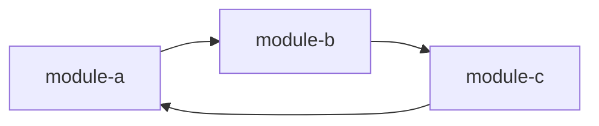

# Codebase Mapper v2 — Advanced Codebase Import & Analysis — featureAI Specification

**Generated:** 2026-03-08
**Mode:** Full (all 10 phases)
**Scope:** Redesign `/pan:map-codebase` for deep codebase import with relationship maps, technical architecture analysis, best practices detection, and lowercase output filenames
**ADR:** ADR-0021

---

## Phase 0: Problem Framing & Demand Validation

### 0.1 Problem Statement

`/pan:map-codebase` currently produces 7 template-driven documents via 4 parallel agents, but the analysis is shallow for importing complex brownfield codebases. The agents rely on bash commands (`find`, `grep`, `ls`) with hardcoded patterns (e.g., `grep -r "import.*stripe"`) that miss most real-world codebases. There is no module dependency graph, no import/export analysis, no relationship mapping between components, no best-practice detection, and no cross-referencing between documents. For a tool whose core value proposition is "understand your codebase before planning," this is the weakest link in the PAN workflow chain.

### 0.2 Demand Evidence

| Evidence Type | Source | Finding |
|--------------|--------|---------|
| Personal pain (user-stated) | This conversation | "this one is little half baked for importing codebases... expand quite heavy, technical arch, relationship maps, best practices, go far and go wide" |
| Competitor feature parity | Aider repo-map | Aider builds tree-sitter AST-based repo maps showing every class/function/method with call relationships |
| Competitor feature parity | Continue.dev @codebase | RAG-based codebase indexing with embeddings for semantic search (has accuracy issues but sets user expectations) |
| Competitor feature parity | DeepWiki | Auto-generates comprehensive wiki from repos with architecture diagrams and relationship maps |
| Competitor feature parity | Swark | LLM-powered architecture diagram generation from code analysis |

### 0.3 Scope Definition

| In Scope | Out of Scope (and why) |
|----------|------------------------|
| Regex-based import/export analysis per language | AST parsing with tree-sitter (adds runtime dep) |
| Module dependency graph (Mermaid) | Interactive visualization (D2, vis.js — adds deps) |
| Circular dependency detection | Auto-fix of circular deps (too dangerous) |
| Best practices detection (patterns matched against known conventions) | Linting/formatting enforcement (existing tools do this) |
| Cross-document references (ARCHITECTURE.md links to STRUCTURE.md) | Hyperlink validation (too fragile) |
| Lowercase output filenames (stack.md not STACK.md) | Renaming existing UPPERCASE files (migration handled separately) |
| 6 focus areas (was 4) with expanded document set | More than 9 output documents (diminishing returns) |
| Language-aware file scanning (JS/TS, Python, Go, Rust, Java, C#) | Every language on earth (cover top 6, fallback for others) |
| Relationship maps (who-calls-whom, who-imports-whom) | Runtime call graph tracing (requires instrumentation) |
| Entry point detection heuristics | Build system integration (too many build tools) |
| Dead code detection (unreferenced exports) | Auto-deletion of dead code (dangerous) |

### 0.4 Success Criteria

```
SC-1: Codebase mapper produces 9 documents (was 7) covering stack, integrations, architecture, structure, conventions, testing, concerns, relationships, and best-practices
SC-2: All output filenames are lowercase (stack.md, not STACK.md)
SC-3: relationships.md contains a Mermaid module dependency graph derived from actual import analysis
SC-4: best-practices.md identifies at least 5 pattern categories with prescriptive guidance
SC-5: Analysis works for JS/TS, Python, Go, Rust, Java, and C# codebases (language-aware scanning)
SC-6: No runtime dependencies added (regex-based analysis only)
SC-7: Cross-platform: works on Windows, Mac, Linux
SC-8: Backward compatible: existing UPPERCASE.md files still consumed by plan-phase/exec-phase
SC-9: Full analysis completes in < 60 seconds for a 10,000-file codebase
```

### 0.5 User Stories

```
As a developer importing a brownfield codebase into PAN,
I want the mapper to discover module relationships and draw dependency graphs,
so that I understand the coupling between components before planning changes,
instead of manually tracing imports across hundreds of files.

As a developer starting a new PAN project on an existing repo,
I want the mapper to detect which best practices are followed vs missing,
so that I can prioritize technical debt cleanup in my roadmap,
instead of discovering convention violations during execution.

As a team lead onboarding developers to a codebase,
I want the mapper to produce a comprehensive architecture document with entry points, layers, and data flows,
so that new developers can orient quickly,
instead of spending days reading code to understand the system.
```

### 0.6 Cannibalization Check

| Existing Command/Agent | Overlap? | Impact |
|-----------------------|----------|--------|
| `/pan:map-codebase` (current) | Full | This IS the redesign — replaces current implementation |
| `pan-document_code` agent | Full | Agent rewritten with expanded focus areas |
| `init map-codebase` command | Partial | Enhanced with new config fields, backward compatible |
| `/pan:focus-scan` | None | Focus-scan reads codebase docs as input, doesn't produce them |
| `drift-check` | None | Drift-check validates conventions, mapper discovers them |

### 0.7 Cognitive Load Assessment

| Metric | Before | After | Delta |
|--------|--------|-------|-------|
| Commands a new user must learn | 42 | 42 | +0 |
| New concepts introduced | 0 | 2 (relationships, best-practices) | +2 |
| Score | — | — | neutral (0) — same command, richer output |

---

## Phase 1: Internal Reconnaissance

### 1.1 Existing Capabilities Inventory

| Capability | Status | Location | Relevance |
|------------|--------|----------|-----------|
| 4 parallel mapper agents | Working | `agents/pan-document_code.md` | Core pattern to keep and extend |
| 7 document templates | Working | `pan-wizard-core/templates/codebase/*.md` | All need lowercase rename + 2 new templates |
| init map-codebase bootstrap | Working | `pan-wizard-core/bin/lib/init.cjs:699-733` | Needs new config fields |
| Orchestrator workflow | Working | `pan-wizard-core/workflows/map-codebase.md` | Needs 6 agents (was 4) |
| Command definition | Working | `commands/pan/map-codebase.md` | Minor updates |
| Secret scanning post-step | Working | workflow step 7 | Keep as-is |
| Mermaid diagram generation | Working (v1) | Templates + agent prompts | Extend with dependency graphs |
| TOGAF-aligned sections | Working (v1) | Templates (ADR-0008) | Keep |

### 1.2 Convention Enforcement Checklist

- [x] Functions named `cmd<Module><Action>(cwd, raw, ...args)` — `cmdInitMapCodebase()`
- [x] File reads use `safeReadFile()` pattern
- [x] JSON output via `output(data, raw, humanLabel)`
- [x] Errors via `error(message)`
- [x] Paths in JSON output pass through `toPosix()`
- [x] CommonJS only (`.cjs` with `require()`)
- [x] Zero runtime dependencies

### 1.3 Integration Points

8 workflows + 4 commands reference codebase documents:
- `/pan:plan-phase` → loads CONVENTIONS.md, STRUCTURE.md, ARCHITECTURE.md, STACK.md, TESTING.md, INTEGRATIONS.md, CONCERNS.md based on phase type
- `/pan:exec-phase` → references conventions, structure, testing patterns
- `/pan:focus-design` → reads codebase docs for Phase 0.8 investigation
- `/pan:research-phase` → loads relevant codebase docs

**Backward compatibility requirement:** All consumers currently expect UPPERCASE.md filenames. The migration must support both until all references are updated.

### 1.4 Dependency Map

```
map-codebase.md (command)
  └─→ map-codebase.md (workflow)
        ├─→ init.cjs:cmdInitMapCodebase() (bootstrap)
        ├─→ pan-document_code agent × 6 (was 4)
        │     └─→ templates/codebase/*.md (9 templates, was 7)
        └─→ commands.cjs:cmdCommit() (auto-commit)
```

---

## Phase 2: Competitive Intelligence

### 2.1 Deep-Dive Research

| Tool | Approach | Strengths | Weaknesses |
|------|----------|-----------|------------|
| **Aider** | tree-sitter AST repo-map: every class/function/method with signatures + call graph | Precise, language-aware, shows relationships | Requires tree-sitter WASM binaries (runtime dep), no architectural narrative |
| **Cursor** | @codebase with embeddings + RAG vector search | Fast semantic search, good for "find related code" | No structured output, no relationship maps, opaque index |
| **Continue.dev** | @codebase with RAG/embeddings, reranking | IDE-integrated, semantic understanding | Known accuracy issues, hallucinated references, slow indexing |
| **Cline** | No indexing — deliberate filesystem traversal + grep per task | No stale index, always fresh, zero setup | Slow for large codebases, no persistent understanding |
| **Swark** | LLM-powered Mermaid architecture diagrams | Visual output, understands high-level patterns | Single-purpose (diagrams only), requires API calls |
| **DeepWiki** | Full auto-wiki generation from repos | Comprehensive, multi-page wiki with diagrams | Requires cloud API, not local, expensive |

### 2.2 Competitive Matrix

| Aspect | PAN (Current) | PAN v2 (Proposed) | Aider | Cursor | Cline | DeepWiki |
|--------|--------------|-------------------|-------|--------|-------|----------|
| Structured output | 7 docs, template-based | 9 docs, cross-referenced | Flat repo-map | None (embeddings) | None | Wiki pages |
| Dependency graphs | None | Mermaid from import analysis | tree-sitter AST | None | None | LLM-generated |
| Best practices | None | Pattern detection | None | None | None | None |
| Language support | Bash grep (fragile) | 6-language regex | tree-sitter (30+ langs) | All (embeddings) | All (grep) | All (LLM) |
| Runtime deps | Zero | Zero | tree-sitter WASM | Embeddings model | None | Cloud API |
| Cross-platform | Yes | Yes | Yes | IDE-only | IDE-only | Web-only |
| Offline capable | Yes | Yes | Yes | No | Yes | No |
| Prescriptive output | Yes (conventions) | Yes (expanded) | No | No | No | Descriptive only |

**PAN v2's unique position:** The only tool that produces structured, prescriptive, cross-referenced analysis documents with dependency graphs AND zero runtime dependencies. Aider is more precise (AST) but less useful (no narrative). DeepWiki is more comprehensive but requires cloud. PAN v2 occupies the sweet spot: thorough enough to be useful, lightweight enough to run anywhere.

---

## Phase 3: Strategic Analysis

### 3.1 Blue Ocean Four Actions Framework

| Action | Decision |
|--------|----------|
| **ELIMINATE** | Hardcoded bash grep patterns in agent (replace with language-aware regex engine) |
| **REDUCE** | Template rigidity — allow agents to expand sections organically while maintaining structure |
| **RAISE** | Relationship awareness — from zero to module dependency graphs with circular dep detection |
| **CREATE** | Best practices detection, cross-document references, dead export identification, entry point heuristics |

### 3.2 Wardley Evolution Assessment

```
Genesis ──── Custom-Built ──── Product ──── Commodity
                    ↑                ↑
              Codebase mapping   Aider repo-map
              with relationships  (AST-based)
```

Codebase analysis is moving from Custom-Built toward Product. Aider's tree-sitter approach is the most productized. PAN v2 targets the Custom-Built→Product boundary: more structured than Aider's flat map, less dependent than Cursor's embeddings.

### 3.3 Strategic Moat Analysis

| Moat Type | Contribution | Score (0-5) |
|-----------|-------------|-------------|
| **Context Engineering** | Structured docs feed directly into plan-phase/exec-phase — no other tool does this | 5 |
| **Cross-Platform** | Works on all 5 AI runtimes + all 3 OS | 5 |
| **Developer Experience** | One command → 9 rich documents | 4 |
| **Zero Dependencies** | Regex-based analysis, no tree-sitter/embeddings needed | 5 |
| **State Persistence** | Codebase docs persist across sessions, consumed by all PAN commands | 4 |
| **Verification Quality** | Drift-check can validate conventions discovered by mapper | 3 |
| **Total** | | **26/30** |

### 3.4 Strategic Recommendation

**Build.** The codebase mapper is PAN's first impression for brownfield projects — the gateway command that determines whether users trust PAN with their existing codebase. The current shallow analysis (bash grep with hardcoded patterns) undermines this trust. The v2 redesign with language-aware import analysis, dependency graphs, and best-practices detection addresses the user's exact pain ("half baked for importing codebases") while maintaining PAN's zero-dependency constraint through regex-only analysis. Our unique angle: no other tool produces structured, prescriptive, cross-referenced analysis that feeds directly into an AI-driven planning and execution pipeline. We explicitly do NOT copy Aider's tree-sitter approach (adds runtime dep) or Cursor's embeddings (opaque, accuracy issues).

---

## Phase 3.5: Architecture & Implementation Assessment

### 3.5.1 Feature Type Classification

| Type | Description |
|------|-------------|
| **Agent rewrite** | `pan-document_code.md` rewritten with 6 focus areas (was 4), language-aware scanning |
| **Template expansion** | 9 templates (was 7), all lowercase filenames |
| **Workflow update** | `map-codebase.md` spawns 6 agents (was 4) |
| **Core enhancement** | `init.cjs:cmdInitMapCodebase()` enhanced with new config |
| **New core module** | `codebase.cjs` — language-aware import parser, dependency graph builder |

### 3.5.2 Layer Violation Check

- [x] Command .md files invoke pan-tools CLI, not core modules directly
- [x] Core modules return data, not import agent .md files
- [x] New `codebase.cjs` module only used by mapper agent via pan-tools CLI
- [x] No upward dependencies

### 3.5.3 Output Contract Design

**`init map-codebase` enhanced output:**
```json
{
  "mapper_model": "string — model for mapper agents",
  "commit_docs": "boolean — auto-commit after mapping",
  "search_gitignored": "boolean",
  "parallelization": "string — agent parallelization mode",
  "codebase_dir": "string — relative path to .planning/codebase/",
  "existing_maps": ["string[] — existing .md filenames"],
  "has_maps": "boolean",
  "planning_exists": "boolean",
  "codebase_dir_exists": "boolean",
  "supported_languages": ["string[] — detected languages in codebase"],
  "file_count": "number — total source files detected",
  "focus_areas": ["string[] — 6 focus area names"]
}
```

**New `codebase analyze-imports` command output:**
```json
{
  "language": "string — detected primary language",
  "modules": "number — total modules analyzed",
  "imports": "number — total import statements found",
  "exports": "number — total export statements found",
  "circular_deps": ["string[] — circular dependency chains"],
  "entry_points": ["string[] — detected entry point files"],
  "orphan_modules": ["string[] — files with exports but no importers"],
  "dependency_graph": "string — Mermaid graph source"
}
```

### 3.5.4 Breaking Change Assessment

| Question | Answer |
|----------|--------|
| Changes any existing command's JSON output schema? | Yes — `init map-codebase` adds 3 new fields (backward compatible, additive) |
| Changes file formats? | Yes — lowercase filenames. Migration: symlink or dual-check in consumers |
| Changes directory structure? | No — still `.planning/codebase/` |
| Changes installer output? | No |

**Migration strategy for lowercase filenames:**
1. New mapper writes lowercase files (stack.md, architecture.md, etc.)
2. All consumers (plan-phase, exec-phase, focus-design, research-phase) updated to check lowercase first, fallback to UPPERCASE
3. `init map-codebase` reports which naming convention is in use
4. No auto-rename of existing files — user runs `/pan:map-codebase` to regenerate

### 3.5.5 Performance Budget

| Operation | Cost | Notes |
|-----------|------|-------|
| File discovery (glob) | ~50ms | Walk source directories |
| Import parsing (6 languages) | ~200ms/1000 files | Regex-based, single-pass per file |
| Dependency graph construction | ~50ms | In-memory adjacency list |
| Circular dependency detection | ~20ms | DFS cycle detection |
| Mermaid generation | ~10ms | String concatenation |
| **Total (core analysis)** | **< 500ms for 5000 files** | |
| Agent execution (6 parallel) | ~30-60s | LLM-bound, not CPU-bound |

### 3.5.6 Cross-Platform Considerations

| Platform | Consideration |
|----------|---------------|
| Windows | `toPosix()` all paths, `path.join()` everywhere, no hardcoded `/` |
| All | Import regex handles both `require('x')` and `import x from 'x'` |
| All | File extension detection case-insensitive on Windows |
| All | Line endings: handle both `\n` and `\r\n` in parsing |

---

## Phase 4: Design Synthesis

### 4.1 Guide-Level Explanation

**Codebase Mapper v2** is the redesigned `/pan:map-codebase` command that produces a comprehensive analysis of your existing codebase. Instead of the previous 7 surface-level documents, v2 produces 9 deeply analyzed documents including module relationship maps and best-practices assessment.

**Example 1: Import a Node.js monorepo**
```
/pan:map-codebase
```
Produces `.planning/codebase/` with:
- `relationships.md` — Mermaid dependency graph showing which modules import which, circular dependency warnings, orphan module detection
- `best-practices.md` — Analysis of which patterns the codebase follows (error handling, testing, naming, security, performance) with prescriptive improvement guidance
- Plus 7 improved existing documents (stack, integrations, architecture, structure, conventions, testing, concerns)

**Example 2: Focus on a subsystem**
```
/pan:map-codebase api
```
Agents focus their analysis on the `api/` or API-related portions of the codebase.

**Example 3: Refresh after changes**
```
/pan:map-codebase
> .planning/codebase/ already exists with 9 documents
> 1. Refresh — remap entire codebase
> 2. Update — remap specific documents
> 3. Skip — use existing
```

**What it does NOT do:**
- Does not use AST parsing or tree-sitter (zero runtime deps)
- Does not index or cache (always fresh analysis)
- Does not modify source code
- Does not require any specific language toolchain

### 4.2 Reference-Level Explanation

#### 4.2.1 New Module: `codebase.cjs`

Core analysis engine with these exported functions:

```
detectLanguages(cwd)          → { primary, secondary, files_by_language }
parseImports(filePath, lang)  → [{ source, specifiers, line, type }]
parseExports(filePath, lang)  → [{ name, type, line, default }]
buildDependencyGraph(cwd)     → { nodes, edges, adjacency }
findCircularDeps(graph)       → [string[]] — each array is a cycle
findEntryPoints(cwd, graph)   → string[] — files with no importers
findOrphanExports(cwd, graph) → string[] — exports never imported
generateMermaidGraph(graph)   → string — Mermaid flowchart source
detectBestPractices(cwd)      → { categories: [...], score, recommendations }
```

**Language-aware import regex patterns:**

| Language | Import Pattern | Export Pattern |
|----------|---------------|----------------|
| JS/TS | `require('...')`, `import ... from '...'`, `import('...')` | `module.exports`, `export default`, `export { }`, `export function` |
| Python | `import ...`, `from ... import ...` | Module-level functions/classes (heuristic) |
| Go | `import "..."`, `import (...)` | Capitalized identifiers (heuristic) |
| Rust | `use ...::...`, `mod ...` | `pub fn`, `pub struct`, `pub mod` |
| Java | `import ...;` | `public class`, `public interface` |
| C# | `using ...;` | `public class`, `public interface`, `namespace` |

#### 4.2.2 Six Focus Areas (was 4)

| Focus | Agent | Documents Produced |
|-------|-------|--------------------|
| **tech** | pan-document_code | `stack.md`, `integrations.md` |
| **arch** | pan-document_code | `architecture.md`, `structure.md` |
| **quality** | pan-document_code | `conventions.md`, `testing.md` |
| **concerns** | pan-document_code | `concerns.md` |
| **relationships** | pan-document_code | `relationships.md` |
| **practices** | pan-document_code | `best-practices.md` |

The `relationships` agent is bootstrapped with pre-computed dependency graph data from `codebase analyze-imports`, avoiding expensive re-scanning by the LLM.

The `practices` agent receives detected language info and scans for known patterns.

#### 4.2.3 New Document: `relationships.md`

```markdown
# Module Relationships

**Analysis Date:** YYYY-MM-DD

## Dependency Overview

**Total modules:** N
**Total import relationships:** N
**Circular dependencies:** N (list below)
**Orphan modules:** N (exported but never imported)
**Entry points:** N (imported by nothing, not exported)

## Module Dependency Graph



## Circular Dependencies

**Cycle 1:** `a.js` → `b.js` → `c.js` → `a.js`
- Severity: High
- Fix approach: Extract shared code into `shared.js`

## High-Coupling Modules

| Module | Incoming | Outgoing | Total | Risk |
|--------|----------|----------|-------|------|
| `src/core.js` | 15 | 3 | 18 | Hub — changes here break many consumers |

## Orphan Modules

Files that export but are never imported (potential dead code):
- `src/utils/legacy.js` — exports `oldHelper()`, `deprecatedFormat()`

## Entry Points

Files that are imported by nothing (application roots):
- `src/index.js` — main entry
- `src/cli.js` — CLI entry

## Layer Violations

Imports that cross architectural boundaries:
- `src/ui/Button.tsx` imports `src/db/query.ts` — UI layer should not access DB layer directly
```

#### 4.2.4 New Document: `best-practices.md`

```markdown
# Best Practices Assessment

**Analysis Date:** YYYY-MM-DD
**Overall Score:** 7/10

## Categories

### Error Handling (8/10)
**Detected patterns:**
- Try-catch in async functions: 85% coverage
- Error types: Custom error classes used in `src/errors/`
- Unhandled promise rejections: 2 found

**Recommendations:**
- Add error boundary in `src/components/App.tsx`
- Wrap `src/api/client.ts` fetch calls in try-catch

### Testing (6/10)
**Detected patterns:**
- Test co-location: Tests in `__tests__/` directories
- Coverage: No coverage config found
- Test types: Unit only, no integration tests

**Recommendations:**
- Add vitest coverage config
- Create integration test suite for API routes

### Naming Conventions (9/10)
**Detected patterns:**
- Files: kebab-case.ts consistently
- Functions: camelCase consistently
- Components: PascalCase consistently
- Constants: UPPER_SNAKE_CASE

**Violations:**
- `src/utils/Helper.ts` — should be `helper.ts` (PascalCase file, not a component)

### Security (5/10)
**Detected patterns:**
- Input validation: Present in API routes
- SQL injection: Parameterized queries used
- XSS: No sanitization in `src/components/RichText.tsx`
- Secrets: `.env.example` exists, `.env` in `.gitignore`

**Recommendations:**
- Add DOMPurify for rich text rendering
- Audit `src/middleware/auth.ts` for timing attacks

### Performance (7/10)
**Detected patterns:**
- Memoization: `useMemo`/`useCallback` in 60% of components
- Lazy loading: `React.lazy()` for route components
- Bundle splitting: Vite config with manual chunks

**Recommendations:**
- Add `useMemo` to `src/components/DataGrid.tsx` (renders 1000+ rows)
```

### 4.3 Design Decisions

| Decision | Rationale | What We Did NOT Copy |
|----------|-----------|---------------------|
| Regex-based import parsing (not AST) | Zero runtime deps, cross-platform, good enough for 90% of cases | Aider's tree-sitter WASM (adds ~5MB dep) |
| 6 focus areas with 6 parallel agents | Fresh context per domain, no token contamination | Cursor's monolithic embedding approach |
| Pre-compute dependency graph, pass to relationship agent | Avoids agent re-scanning thousands of files | DeepWiki's full-LLM analysis (expensive) |
| Lowercase filenames | User request + convention alignment (.planning/ files are lowercase) | N/A |
| Best practices as scored categories | Prescriptive, actionable, prioritized | Swark's diagram-only approach |
| Language detection heuristic (file extensions + package files) | Simple, fast, no external tools | Linguist/enry (adds dep) |

### 4.4 Drawbacks & Alternatives

| Decision | Chosen | Alternative | Why Not | Drawback |
|----------|--------|------------|---------|----------|
| Regex imports | Regex patterns per language | tree-sitter AST | Adds 5MB WASM runtime dep | Misses complex patterns (re-exports, dynamic imports) |
| 6 agents | 6 parallel agents | Single agent, 9 docs | Token contamination, slower | Higher token cost (6 agent spawns) |
| New codebase.cjs module | Dedicated module | Add to core.cjs | core.cjs already 400+ LOC | New file to maintain |
| Lowercase files | lowercase.md | Keep UPPERCASE.md | User explicitly requested lowercase | Migration period with dual naming |

### 4.5 Feature Ladder

| Version | Scope | Value Delivered | Effort |
|---------|-------|----------------|--------|
| **v0 (MVP)** | `codebase.cjs` with JS/TS import parsing + dependency graph + `relationships.md` template + `best-practices.md` template + lowercase filenames + 6 focus areas | Dependency graphs and best-practice assessment for JS/TS codebases | M (13 pts) |
| **v1 (Complete)** | Add Python, Go, Rust, Java, C# language support + circular dep detection + orphan detection + entry point heuristics + enhanced agent prompts | Full 6-language support with advanced analysis | M (10 pts) |
| **v2 (Enhanced)** | Layer violation detection, coupling metrics, change-impact analysis ("if I change X, what breaks?"), incremental refresh (only re-analyze changed files) | Architectural intelligence | L (15 pts) |

### 4.6 Adoption Analysis

| Question | Answer |
|----------|--------|
| How does the user discover this feature? | Same command: `/pan:map-codebase` — existing users get richer output automatically |
| What's the learning curve? | Zero — same invocation, richer output |
| Does it require changing existing workflows? | No — drop-in replacement |
| What's the "aha moment"? | Opening `relationships.md` and seeing a Mermaid dependency graph of your entire codebase with circular deps highlighted |

---

## Phase 5: Architecture Decision Record

See `docs/decisions/ADR-0021-codebase-mapper-v2.md` (written as Phase 10 artifact).

---

## Phase 6: Error Handling & Diagnostics Design

### 6.1 Failure Mode Analysis

| Failure Mode | Category | Detection | Recovery | User Sees |
|-------------|----------|-----------|----------|-----------|
| No source files found | User error | `detectLanguages()` returns empty | JSON error + hint | `{"error": "No source files found", "hint": "Ensure codebase has .js/.ts/.py/.go/.rs/.java/.cs files"}` |
| Import regex misparse | Analysis limit | Graceful skip (log warning in verbose) | Continue analysis, note in `relationships.md` | Slightly incomplete graph |
| Circular dep in stdlib imports | False positive | Filter known stdlib/node_modules paths | Exclude from results | Clean output |
| `.planning/codebase/` not writable | Environment | try-catch on mkdirSync | JSON error | `{"error": "Cannot create .planning/codebase/"}` |
| Agent timeout/failure | LLM issue | Agent returns no confirmation | Note failed focus area, continue | Partial mapping with clear report |
| Massive codebase (100k+ files) | Performance | File count check in init | Warn + suggest focus area filter | Warning in init output |
| Binary files in source dirs | Data | File size + null byte check | Skip binary files | Clean analysis |

### 6.2 Diagnostic Support

| Diagnostic | How | When |
|------------|-----|------|
| `codebase analyze-imports --verbose` | Shows per-file import details | Debugging import analysis |
| `init map-codebase` | Shows detected languages, file counts | Before running mapper |
| Agent confirmation output | Reports line counts per document | After mapping |
| `--files` flag on analyze-imports | Analyze specific files only | Debugging specific modules |

---

## Phase 7: Security & Threat Model

### 7.1 Asset & Attack Surface

| Asset | Accessed How | Trust Level |
|-------|-------------|-------------|
| Source code files | Read-only scan | User-controlled |
| `.planning/codebase/*.md` | Write (analysis output) | System-generated |
| Import/export data | Regex extraction from source | Derived from user code |

| Input Vector | Validation Required |
|-------------|-------------------|
| File paths (source files) | Must be within cwd, no `..` traversal |
| File content (parsed for imports) | No eval(), regex only, size limit (DRIFT_MAX_FILE_SIZE) |
| Language detection | Based on file extensions, not content execution |

### 7.2 Path Safety

- All file paths resolved relative to `cwd` via `path.resolve(cwd, filePath)`
- Verify resolved path starts with `path.resolve(cwd)`
- Skip files in `node_modules/`, `.git/`, `dist/`, `build/`
- Respect `.gitignore` unless `search_gitignored` config is true
- Output paths pass through `toPosix()`

### 7.3 Output Sanitization

- [x] No absolute filesystem paths in output
- [x] No environment variable values
- [x] No file content beyond import/export statements
- [x] Forbidden files list (`.env`, credentials, keys) respected by agents AND core module
- [x] Dependency graph shows module names only, not file content

### 7.4 Content Validation

- Import parsing uses regex only — never `eval()` or `Function()`
- File content read as UTF-8 text — binary files skipped (null byte detection)
- Maximum file size: 1MB (reuse `DRIFT_MAX_FILE_SIZE` constant)
- Maximum files per analysis: 50,000 (configurable, prevents OOM)

---

## Phase 8: Implementation Roadmap

### 8.1 v0 (MVP) Task Breakdown

#### Task 1: Create `codebase.cjs` core module
**Files:** `pan-wizard-core/bin/lib/codebase.cjs` (new)
**Scope:**
- `detectLanguages(cwd)` — scan file extensions, detect primary/secondary languages
- `parseImports(filePath, lang)` — regex-based import extraction for JS/TS (v0), extensible for other languages (v1)
- `parseExports(filePath, lang)` — regex-based export extraction for JS/TS (v0)
- `buildDependencyGraph(cwd)` — walk source files, parse imports, build adjacency list
- `findCircularDeps(graph)` — DFS cycle detection on adjacency list
- `findEntryPoints(cwd, graph)` — files with zero incoming edges
- `findOrphanExports(cwd, graph)` — exported symbols never imported anywhere
- `generateMermaidGraph(graph, maxNodes)` — render top-N modules as Mermaid LR flowchart
- `detectBestPractices(cwd)` — scan for 5 pattern categories: error handling, testing, naming, security, performance
**Estimate:** M (5 pts)
**Priority:** P1

#### Task 2: Add `codebase` CLI dispatcher routes
**Files:** `pan-wizard-core/bin/pan-tools.cjs`
**Scope:**
- `codebase analyze-imports` → `codebase.cmdAnalyzeImports(cwd, raw, args)`
- `codebase detect-languages` → `codebase.cmdDetectLanguages(cwd, raw)`
- `codebase best-practices` → `codebase.cmdBestPractices(cwd, raw)`
**Estimate:** XS (1 pt)
**Priority:** P1

#### Task 3: Create lowercase templates
**Files:** `pan-wizard-core/templates/codebase/relationships.md` (new), `pan-wizard-core/templates/codebase/best-practices.md` (new)
**Scope:**
- `relationships.md` template with dependency overview, Mermaid graph, circular deps, high-coupling, orphans, entry points, layer violations sections
- `best-practices.md` template with scored categories (error handling, testing, naming, security, performance), detected patterns, recommendations
**Estimate:** S (2 pts)
**Priority:** P1

#### Task 4: Enhance `init map-codebase`
**Files:** `pan-wizard-core/bin/lib/init.cjs`
**Scope:**
- Add `supported_languages`, `file_count`, `focus_areas` to output
- Call `detectLanguages(cwd)` for language detection
- Report 6 focus areas (was 4)
**Estimate:** XS (1 pt)
**Priority:** P1

#### Task 5: Rewrite mapper agent for 6 focus areas
**Files:** `agents/pan-document_code.md`
**Scope:**
- Add `relationships` focus: consume pre-computed graph data, write `relationships.md`
- Add `practices` focus: consume language detection, scan for patterns, write `best-practices.md`
- Update all existing focus areas to use lowercase filenames
- Replace hardcoded bash grep patterns with language-aware guidance
- Add `<files_to_read>` injection for pre-computed data (relationships agent receives graph JSON)
**Estimate:** S (3 pts)
**Priority:** P1

#### Task 6: Update orchestrator workflow
**Files:** `pan-wizard-core/workflows/map-codebase.md`
**Scope:**
- Spawn 6 agents (was 4): add `relationships` and `practices`
- Before spawning `relationships` agent: call `codebase analyze-imports`, pass result in agent prompt
- Before spawning `practices` agent: call `codebase detect-languages`, pass result in agent prompt
- Verify 9 documents (was 7)
- Update expected filenames to lowercase
**Estimate:** S (2 pts)
**Priority:** P1

#### Task 7: Update consumers for lowercase filenames
**Files:** Multiple workflow .md files, plan-phase, exec-phase, focus-design, research-phase
**Scope:**
- All codebase doc references: check lowercase first, fallback to UPPERCASE
- Helper function in workflow: `resolve_codebase_doc(name)` tries both
**Estimate:** S (2 pts)
**Priority:** P2

#### Task 8: Tests for codebase.cjs
**Files:** `tests/codebase.test.cjs` (new)
**Scope:**
- Unit tests for all exported functions
- Integration tests via `runPanTools('codebase analyze-imports', tmpDir)`
- Contract tests for output schemas
**Estimate:** M (5 pts)
**Priority:** P1

#### Task 9: Documentation updates
**Files:** `docs/CLI-REFERENCE.md`, `CHANGELOG.md`, `README.md`
**Scope:**
- Add `codebase` command family to CLI reference
- Update map-codebase description
- Changelog entry
**Estimate:** XS (1 pt)
**Priority:** P3

### 8.2 Dependency Graph

```
Task 1 (codebase.cjs core module)
  ├─→ Task 2 (CLI dispatcher)
  ├─→ Task 4 (init enhancement)
  ├─→ Task 8 (tests)
  └─→ Task 5 (agent rewrite) + Task 6 (workflow update)
        └─→ Task 7 (consumer updates)

Task 3 (templates) — independent, parallel with Task 1

Task 9 (docs) — after all others
```

### 8.3 Recommended Execution Waves

#### Wave 1: Foundation (parallel) — 8 pts
| # | Task | Effort |
|---|------|--------|
| 1 | `codebase.cjs` core module | M (5) |
| 3 | New templates (relationships.md, best-practices.md) | S (2) |
| 4 | Enhanced `init map-codebase` | XS (1) |

#### Wave 2: Integration — 6 pts
| # | Task | Effort |
|---|------|--------|
| 2 | CLI dispatcher routes | XS (1) |
| 5 | Mapper agent rewrite | S (3) |
| 6 | Workflow update | S (2) |

#### Wave 3: Consumers + Tests — 7 pts
| # | Task | Effort |
|---|------|--------|
| 7 | Consumer lowercase fallback | S (2) |
| 8 | Test suite | M (5) |

#### Wave 4: Docs — 1 pt
| # | Task | Effort |
|---|------|--------|
| 9 | Documentation | XS (1) |

### 8.4 Risk Register

| Risk | Probability | Impact | Mitigation |
|------|------------|--------|------------|
| Regex misses complex import patterns (re-exports, barrel files) | Medium | Low | Document known limitations, iterate in v1 |
| Agent generates poor-quality relationships.md from pre-computed data | Medium | Medium | Rich prompt with examples, pre-computed graph gives agent a head start |
| Lowercase filename migration breaks existing projects | Low | High | Dual-check (lowercase then UPPERCASE) in all consumers |
| Performance on very large codebases (100k+ files) | Low | Medium | File count warning in init, configurable max |
| 6 agents hit rate limits | Low | Medium | Agent spawning already handles retries |

### 8.5 Cognitive Complexity Budget

All new functions in `codebase.cjs`:
- Max 50 lines per function
- Max 3 nesting levels
- Max 4 parameters (use options object for `buildDependencyGraph`)
- `parseImports()` uses a pattern registry (object of lang → regex[]) not nested if/else

---

## Phase 9: Test Plan

### 9.1 Test Pyramid

| Level | Count | What It Catches |
|-------|-------|-----------------|
| **Unit** | 25+ | Import parsing accuracy, graph algorithms, language detection, best-practices patterns |
| **Integration** | 10+ | CLI dispatch, JSON output shape, end-to-end codebase analysis |
| **E2E** | 3+ | Full map-codebase workflow with 6 agents, document verification |

### 9.2 Unit Test Plan for `codebase.cjs`

**detectLanguages (4 tests):**
- JS/TS project (has package.json, .ts files) → primary: "typescript"
- Python project (has requirements.txt, .py files) → primary: "python"
- Mixed project → primary + secondary
- Empty directory → `{ primary: null, secondary: [], files_by_language: {} }`

**parseImports — JS/TS (8 tests):**
- `require('fs')` → `{ source: 'fs', type: 'require' }`
- `import x from './module'` → `{ source: './module', type: 'esm' }`
- `import { a, b } from 'pkg'` → `{ source: 'pkg', type: 'esm' }`
- `import('./lazy')` → `{ source: './lazy', type: 'dynamic' }`
- `const x = require('./local')` → `{ source: './local', type: 'require' }`
- Multi-line imports → parsed correctly
- Comments containing import → ignored
- String containing import → ignored

**parseExports — JS/TS (5 tests):**
- `module.exports = { fn }` → `[{ name: 'fn', type: 'cjs' }]`
- `export default class Foo` → `[{ name: 'Foo', type: 'esm', default: true }]`
- `export function bar()` → `[{ name: 'bar', type: 'esm' }]`
- `export { a, b }` → 2 exports
- No exports → `[]`

**buildDependencyGraph (4 tests):**
- Simple A→B→C chain → correct adjacency
- Self-import → ignored
- Node_modules import → excluded from graph
- Relative imports resolved to actual files

**findCircularDeps (3 tests):**
- No cycles → `[]`
- A→B→A cycle → `[['A', 'B', 'A']]`
- Complex graph with multiple cycles → all detected

**findEntryPoints (2 tests):**
- File with no importers → included
- File imported by others → excluded

**findOrphanExports (2 tests):**
- Export never imported → included
- Export imported elsewhere → excluded

**generateMermaidGraph (3 tests):**
- Small graph → valid Mermaid syntax
- Empty graph → `"graph LR\n    (no modules found)"`
- Large graph (>15 nodes) → truncated with note

**detectBestPractices (4 tests):**
- Codebase with try-catch → error handling score > 0
- Codebase with test files → testing score > 0
- Codebase with consistent naming → naming score > 0
- Empty codebase → all scores 0

### 9.3 Integration Test Plan

**CLI dispatch (3 tests):**
- `codebase analyze-imports` → valid JSON with expected fields
- `codebase detect-languages` → valid JSON with `primary` field
- `codebase best-practices` → valid JSON with `categories` array

**Contract tests (3 tests):**
- `codebase analyze-imports` schema validation
- `codebase detect-languages` schema validation
- `codebase best-practices` schema validation

**init map-codebase enhanced (2 tests):**
- Returns new fields: `supported_languages`, `file_count`, `focus_areas`
- `focus_areas` has 6 entries

**Lowercase filename (2 tests):**
- New mapping writes lowercase files
- Consumer finds lowercase file when UPPERCASE doesn't exist

### 9.4 Boundary Value Analysis

- [x] Empty codebase (zero source files)
- [x] Single file codebase
- [x] Codebase with only node_modules (no user code)
- [x] File with 1000+ imports (stress test)
- [x] Circular dependency chain of length 10+
- [x] Binary file mixed with source files
- [x] File paths with spaces and special characters
- [x] Windows-style paths (backslashes)
- [x] Symlinked directories
- [x] File larger than DRIFT_MAX_FILE_SIZE (skipped)

### 9.5 Regression Verification

After implementing, verify:
- [x] `npm test` — ALL existing tests pass unchanged
- [x] `tests/init.test.cjs` — init map-codebase tests still pass
- [x] Existing codebase mapper workflow still works (backward compatible)
- [x] All consumers that read codebase docs still function with UPPERCASE files

---

## Phase 10: Output Artifacts

### 10.1 Specification Document
Written to: `docs/specs/codebase_mapper_v2_featureai.md` (this file)

### 10.2 ADR
Written to: `docs/decisions/ADR-0021-codebase-mapper-v2.md`

### 10.3 Report Summary

## /featureAI Complete — Codebase Mapper v2

### Problem & Evidence
Shallow codebase analysis ("half baked for importing codebases") — lacks relationship maps, dependency graphs, best-practices detection. Evidence: user pain, Aider/DeepWiki feature parity, Swark competition.

### Strategic Assessment
- Blue Ocean: Eliminate hardcoded grep, Reduce template rigidity, Raise relationship awareness, Create best-practices detection + dependency graphs
- Wardley: Custom-Built → Product boundary
- Moat Score: 26/30 — strongest in Context Engineering (5) + Zero Dependencies (5) + Cross-Platform (5)
- Cognitive Load: neutral (0) — same command, richer output
- Recommendation: BUILD — gateway command for brownfield projects, must be best-in-class

### Design Summary
- Feature Type: Agent rewrite + New core module + Template expansion + Workflow update
- Modules Affected: `codebase.cjs` (new), `init.cjs`, `pan-tools.cjs`, `pan-document_code.md`, `map-codebase.md` (workflow)
- Output Schema: 3 new commands (`codebase analyze-imports`, `detect-languages`, `best-practices`)
- Error Handling: Graceful degradation (skip unparseable files, continue analysis)
- Breaking Changes: Lowercase filenames (migration: dual-check in consumers)
- Layer Violations: None

### Feature Ladder
- v0 (MVP): JS/TS import analysis + dependency graph + best-practices + lowercase filenames + 6 agents — M (22 pts)
- v1 (Complete): 6-language support + circular dep detection + orphan detection — M (10 pts)
- v2 (Enhanced): Layer violation detection, coupling metrics, change-impact analysis — L (15 pts)

### Implementation
- Tasks: 9 tasks across 4 waves
- Complexity: M (22 total points for v0)
- Files to create: 3 (`codebase.cjs`, `relationships.md` template, `best-practices.md` template)
- Files to modify: 6 (`init.cjs`, `pan-tools.cjs`, `pan-document_code.md`, `map-codebase.md` workflow, consumer workflows, `map-codebase.md` command)
- Tests planned: 38+ (unit: 25+, integration: 10+, e2e: 3+)

### Security
- Attack surface: Read-only source file scanning, regex-only parsing, no eval()
- Path safety: All paths resolved within cwd, toPosix() on output
- Output sanitization: No absolute paths, no file content beyond import statements

### Adoption
- Discovery: Same `/pan:map-codebase` command — automatic upgrade
- Learning curve: Zero (drop-in replacement)
- Aha moment: Opening `relationships.md` and seeing a Mermaid dependency graph with circular deps

### Documents Created
- Spec: `docs/specs/codebase_mapper_v2_featureai.md`
- ADR: `docs/decisions/ADR-0021-codebase-mapper-v2.md`

### Next Step
Add to superplan: `/pan:focus-scan`
Execute: `/pan:focus-exec`
